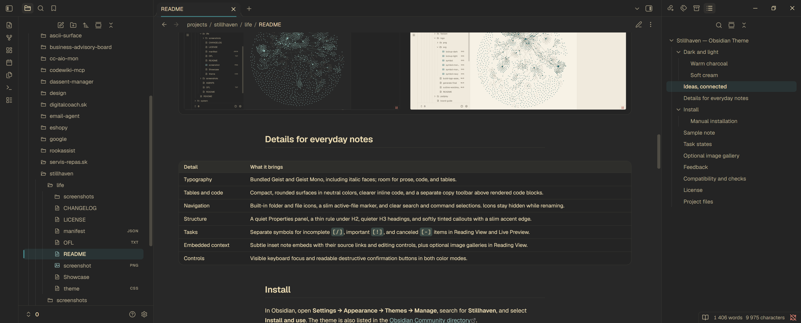
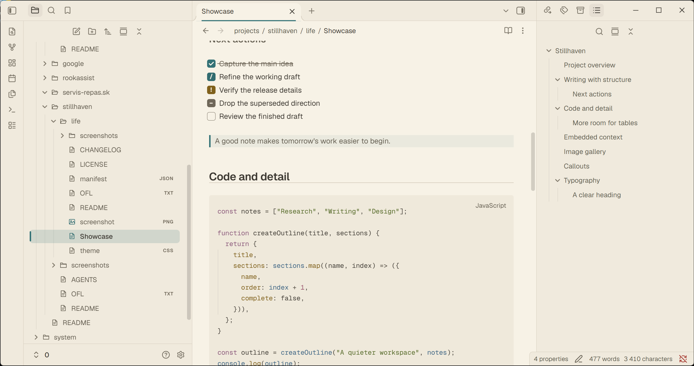
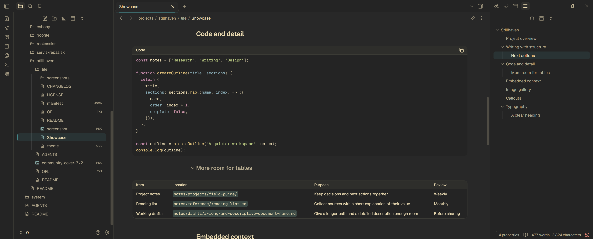
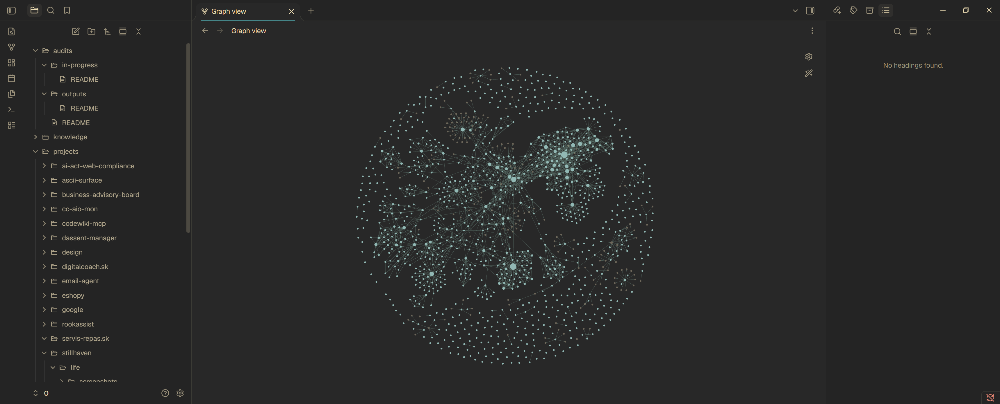
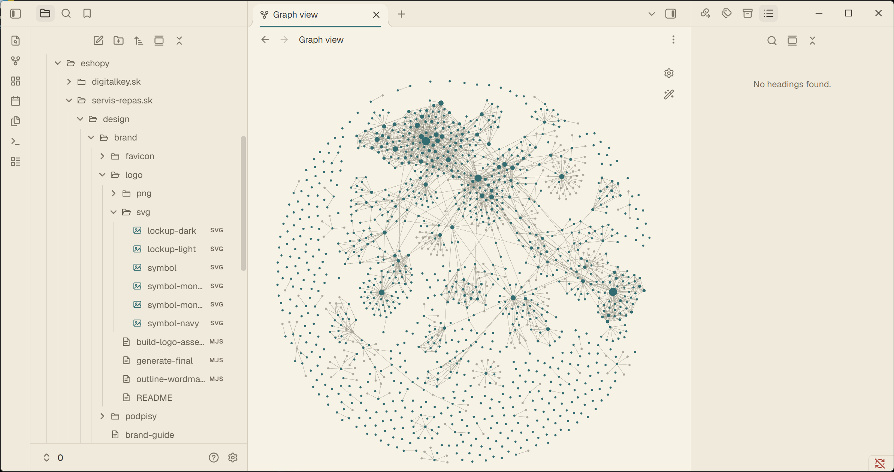

# Stillhaven — Obsidian Theme

A warmer space for your notes. Stillhaven brings warm charcoal, soft cream,
and muted teal to Obsidian, with embedded typography and thoughtful details
for writing, navigating, and connecting ideas.


[](https://github.com/iM3SK/stillhaven-obsidian-theme/releases/latest)
[](manifest.json)
[](https://github.com/iM3SK/stillhaven-obsidian-theme/actions/workflows/quality.yml)
[](LICENSE)

[Download the latest release](https://github.com/iM3SK/stillhaven-obsidian-theme/releases/latest)
· [Release notes](CHANGELOG.md)
· [Report a bug](https://github.com/iM3SK/stillhaven-obsidian-theme/issues/new)

## Dark and light

### Warm charcoal

Cream text, a quiet active-file marker, softly tinted callouts, and distinct
task states give longer notes a clear rhythm.



### Soft cream

A warm paper palette with teal accents, readable code, and the same note
structure in light mode.



### Code, with room to read

A compact toolbar keeps the copy button above the code. Neutral surfaces match
the surrounding note, while inline code has a clearer background.



## Ideas, connected

Teal note nodes and clearer connections give Graph view a place in the palette.
Focused notes use a warm highlight; tags and attachments have distinct colors.
Your existing graph color groups remain available.

| Dark graph | Light graph |
| --- | --- |
|  |  |

## Details for everyday notes

| Detail | What it brings |
| --- | --- |
| Typography | Bundled Geist and Geist Mono, including italic faces; room for prose, code, and tables. |
| Tables and code | Compact, rounded surfaces in neutral colors, clearer inline code, and a separate copy toolbar above rendered code blocks. |
| Navigation | Built-in folder and file icons, a slim active-file marker, and clear search and command selections. Icons stay hidden while renaming. |
| Structure | A quiet Properties panel, a thin rule under H2, quieter H3 headings, and softly tinted callouts with a slim accent edge. |
| Tasks | Separate symbols for incomplete `[/]`, important `[!]`, and canceled `[-]` items in Reading View and Live Preview. |
| Embedded context | Subtle inset note embeds with their source links and editing controls, plus optional image galleries in Reading View. |
| Controls | Visible keyboard focus and readable destructive confirmation buttons in both color modes. |

## Install

In Obsidian, open **Settings → Appearance → Themes → Manage**, search for
**Stillhaven**, and select **Install and use**. The theme is also listed in the
[Obsidian Community directory](https://community.obsidian.md/themes/stillhaven).

Use **Check for updates** under Appearance to update an installed community
theme when a new release is available.

### Manual installation

Download these four release assets:

- [theme.css](https://github.com/iM3SK/stillhaven-obsidian-theme/releases/latest/download/theme.css)
- [manifest.json](https://github.com/iM3SK/stillhaven-obsidian-theme/releases/latest/download/manifest.json)
- [OFL.txt](https://github.com/iM3SK/stillhaven-obsidian-theme/releases/latest/download/OFL.txt)
- [LICENSE](https://github.com/iM3SK/stillhaven-obsidian-theme/releases/latest/download/LICENSE)

1. Open your vault folder and find its Obsidian configuration folder
   (normally `.obsidian`).
2. Create a `Stillhaven` folder inside `themes`.
3. Copy the downloaded files into that folder.
4. In Obsidian, open **Settings → Appearance** and select **Stillhaven**.
5. Choose the light or dark base color scheme in the same settings page.

The manifest requires Obsidian 1.13.0 or later. No community plugin or separate
font installation is required.

To update a manual installation, replace those files with the assets from the
latest release and reload Obsidian.

## Sample note

[Showcase.md](Showcase.md) is a synthetic sample note for previewing Properties,
task states, note embeds, image galleries, typography, tables, code, and callouts.
Copy it into your vault together with
[appearance-dark.png](screenshots/appearance-dark.png) and
[appearance-light.png](screenshots/appearance-light.png), keeping both images
inside a `screenshots` folder. Keep the sample's filename so its embedded
Typography section resolves.

## Task states

Write the marker directly in a Markdown task:

```markdown
- [/] Work in progress
- [!] Important detail
- [-] Canceled direction
```

These markers change the appearance in Reading View and Live Preview. Obsidian
treats every non-empty marker as checked; clicking it clears the checkbox. To
choose another custom state, edit the character between the brackets.

## Optional image gallery

Put images inside Stillhaven's custom `gallery` callout:

```markdown
> [!gallery] Reference images
> ![[first-image.png]]
> ![[second-image.png]]
```

Use your own image filenames. Consecutive image lines and images separated by
blank quoted lines both work. Place descriptions before or after the callout;
its content should contain only images. In Reading View, images stay in source
order, filling each row from left to right, and use one to four columns according
to the gallery's available width. Their proportions are preserved. Live Preview,
Canvas, and print/PDF keep the regular image layout. No plugin is needed.

## Feedback

For layout or styling problems, [open an issue](https://github.com/iM3SK/stillhaven-obsidian-theme/issues/new).
Include the theme and Obsidian versions, your operating system, the light or
dark mode, and steps to reproduce the issue.
If CSS snippets or community plugins are active, check whether the problem also
occurs with them disabled and include that result.

For an improvement suggestion, explain the note-taking task it would help.

## Compatibility

Stillhaven styles Obsidian's native interface and controls. CSS snippets and
community plugins can affect its appearance.

Mobile layouts, Canvas, Bases, and the minimum declared Obsidian version have
not been separately verified.

[Code quality](https://github.com/iM3SK/stillhaven-obsidian-theme/actions/workflows/quality.yml)
checks CSS, the theme manifest, bundled license notices, and Markdown.

## License

Stillhaven's theme code and documentation are licensed under the
[MIT License](LICENSE), copyright (c) 2026 iM3SK.
The bundled Geist and Geist Mono fonts remain under the SIL Open Font License
in [OFL.txt](OFL.txt); the theme's MIT license does not replace their license.

Both complete license notices are also included in `theme.css`, so they travel
with the theme when an installer downloads only the CSS and manifest.

## Project files

- [theme.css](theme.css) contains the styles and embedded font and icon assets.
- [manifest.json](manifest.json) contains the theme name, version, and author.
- [LICENSE](LICENSE) contains the MIT license for the theme code and documentation.
- [OFL.txt](OFL.txt) contains the existing license for the bundled fonts.
- [Showcase.md](Showcase.md) contains the sample note.
- [CHANGELOG.md](CHANGELOG.md) contains release notes.

Created by [iM3SK](https://github.com/iM3SK).
