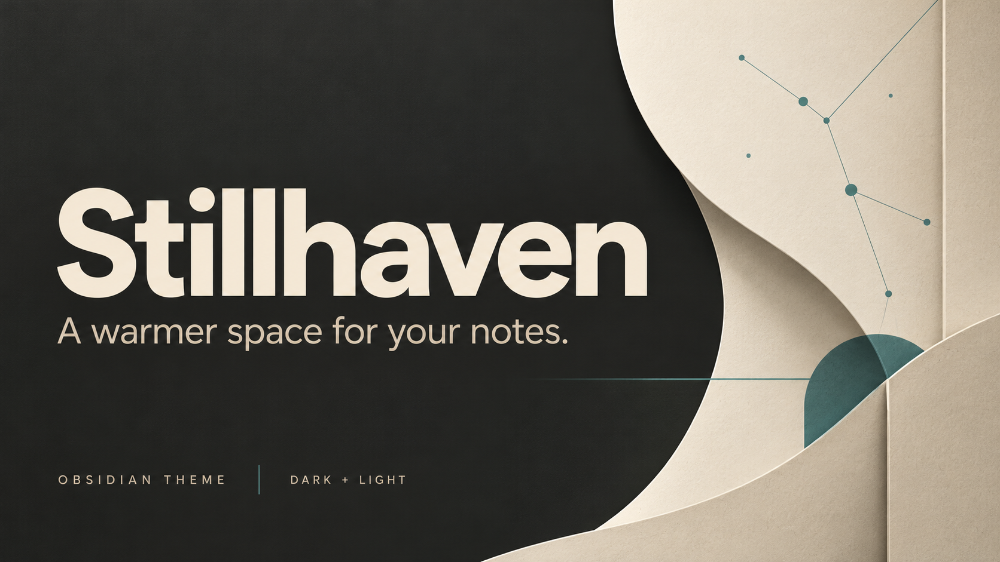
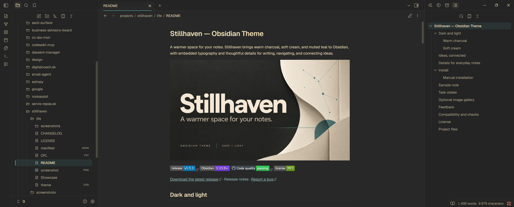
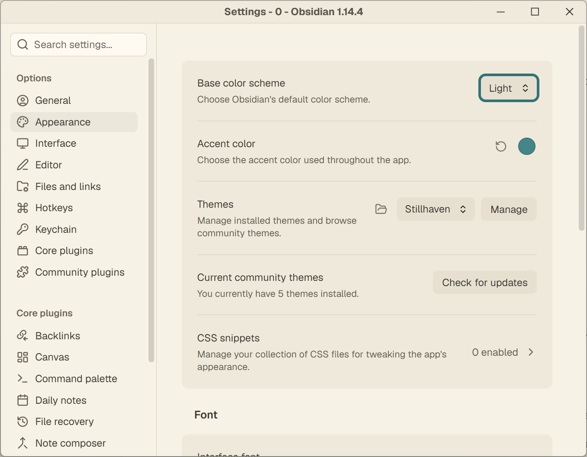

# Stillhaven — Obsidian Theme

A warm, focused theme for Obsidian, with dark and light color modes,
embedded typography, and small details that make everyday notes easier to read.

[](https://github.com/iM3SK/stillhaven-obsidian-theme/releases/latest)
[](manifest.json)

[Download the latest release](https://github.com/iM3SK/stillhaven-obsidian-theme/releases/latest)
· [Release notes](CHANGELOG.md)
· [Report a bug](https://github.com/iM3SK/stillhaven-obsidian-theme/issues/new)



## Appearance

- Warm charcoal and cream palettes with a muted teal accent.
- Bundled Geist and Geist Mono fonts, including italic faces.
- Folder and file icons built into the theme, hidden while renaming.
- Softly tinted callout cards with a slim accent edge and roomier content.
- A slim teal marker and accented icon identify the active file without shifting
  the file list.
- A quiet Properties panel with distinct labels, values, and native focus states.
- Separate symbols for incomplete `[/]`, important `[!]`, and canceled `[-]` tasks.
- Subtle inset note embeds that keep their source links and editing controls.
- A thin rule under H2 and quieter H3 headings for scanning longer notes.
- Optional image galleries using a `gallery` callout in Reading View.
- Readable prose with extra room for code blocks and tables.
- Visible keyboard focus and clear search and command selections.

## Install manually

Download these four release assets:

- [theme.css](https://github.com/iM3SK/stillhaven-obsidian-theme/releases/latest/download/theme.css)
- [manifest.json](https://github.com/iM3SK/stillhaven-obsidian-theme/releases/latest/download/manifest.json)
- [OFL.txt](https://github.com/iM3SK/stillhaven-obsidian-theme/releases/latest/download/OFL.txt)
- [LICENSE](https://github.com/iM3SK/stillhaven-obsidian-theme/releases/latest/download/LICENSE)

1. Open your vault folder and find its Obsidian configuration folder
   (normally `.obsidian`).
2. Create a `Stillhaven` folder inside `themes`.
3. Copy the downloaded files into that folder.
4. In Obsidian, open **Settings → Appearance** and select **Stillhaven**.
5. Choose the light or dark base color scheme in the same settings page.

The manifest requires Obsidian 1.13.0 or later. No community plugin or separate
font installation is required.

To update a manual installation, replace those files with the assets from the
latest release and reload Obsidian. Stillhaven is not yet listed in Obsidian's
Community Themes directory.

## Sample note

[Showcase.md](Showcase.md) is a synthetic sample note for previewing Properties,
task states, note embeds, image galleries, typography, tables, code, and callouts.
Copy it and the `screenshots` folder into your vault to try the same content.
Keep the sample's filename so its embedded Typography section resolves.

## Task states

Write the marker directly in a Markdown task:

```markdown
- [/] Work in progress
- [!] Important detail
- [-] Canceled direction
```

These markers change the appearance in Reading View and Live Preview. Obsidian
treats every non-empty marker as checked; clicking it clears the checkbox. To
choose another custom state, edit the character between the brackets.

## Optional image gallery

Put images inside Stillhaven's custom `gallery` callout:

```markdown
> [!gallery] Reference images
> ![[first-image.png]]
> ![[second-image.png]]
```

Use your own image filenames. Consecutive image lines and images separated by
blank quoted lines both work. Place descriptions before or after the callout;
its content should contain only images. Reading View arranges them into columns
and keeps each image's proportions. Narrow panes use a single column. Live
Preview, Canvas, and print/PDF keep the regular image layout. No plugin is needed.

## Appearance settings

### Dark mode



### Light mode



## Feedback

For layout or styling problems, [open an issue](https://github.com/iM3SK/stillhaven-obsidian-theme/issues/new).
Include the theme and Obsidian versions, your operating system, the light or
dark mode, and steps to reproduce the issue.
If CSS snippets or community plugins are active, check whether the problem also
occurs with them disabled and include that result.

For an improvement suggestion, explain the note-taking task it would help.

## Scope and verification

Stillhaven styles Obsidian's existing interface. Built-in controls and editing
behavior remain managed by Obsidian.

Reading view, Live Preview, command palette, search, and table scrolling were
checked on Windows with Obsidian 1.14.4 before the 1.4.0 additions. The callout
and active-file styles were checked in browser fixtures against Obsidian 1.14.4
styles; a live Obsidian review of those additions remains pending.

Properties, task symbols, note embeds, heading hierarchy, and galleries were
checked in browser fixtures using Obsidian 1.14.4 styles in dark and light modes,
with wide and narrow panes. The fixtures also checked checkbox focus, gallery
paragraph breaks, and exclusions for Canvas and print-preview markup. The native
CLI was unavailable during this check, so a live Obsidian review of the 1.4.0
additions and the complete sample note remains pending. The minimum declared
version, mobile layouts, Canvas, and Bases have not been separately verified.
Community Themes submission is still pending.

## License

Stillhaven's theme code and documentation are licensed under the
[MIT License](LICENSE), copyright (c) 2026 iM3SK.
The bundled Geist and Geist Mono fonts remain under the SIL Open Font License
in [OFL.txt](OFL.txt); the theme's MIT license does not replace their license.

Both complete license notices are also included in `theme.css`, so they travel
with the theme when an installer downloads only the CSS and manifest.

## Project files

- [theme.css](theme.css) contains the styles and embedded font and icon assets.
- [manifest.json](manifest.json) contains the theme name, version, and author.
- [LICENSE](LICENSE) contains the MIT license for the theme code and documentation.
- [OFL.txt](OFL.txt) contains the existing license for the bundled fonts.
- [Showcase.md](Showcase.md) contains the sample note.
- [CHANGELOG.md](CHANGELOG.md) contains release notes.

Created by [iM3SK](https://github.com/iM3SK).
